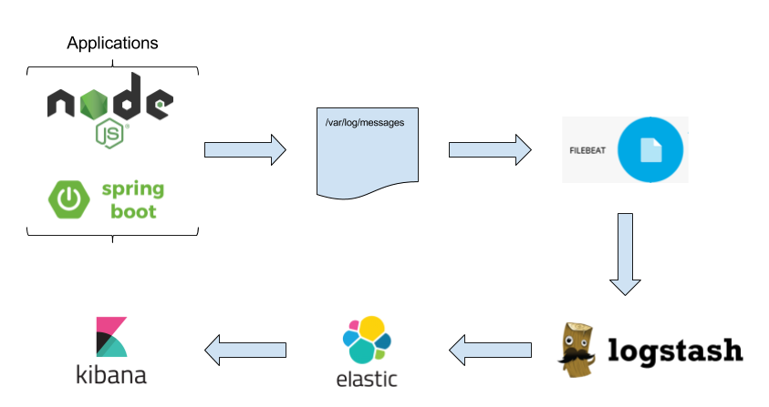
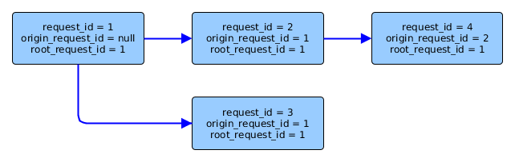
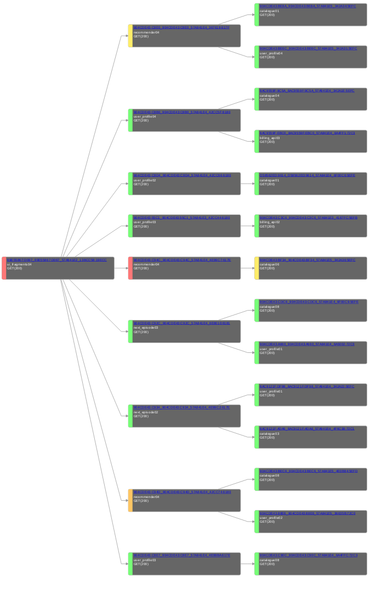

# Logging

In a microservice architecture it becomes increasingly important to standardise on a mechanism and format for logging. The ELK stack has been selected to provide a central store and interface to logs from services within Reform. What is missing is a standard approach for every microservice to follow to allow for simple integration and minimal maintenance of the logging component going forward.

## JSON formatting

Microservices should format their logging output to be json only. This has the following benefits

- JSON logs make it much easier to pick out specific pieces of information from logs and makes it much easier to make changes to the format.
- We are using the ELK stack (Elasticsearch, LogStash and Kibana). This stack uses JSON formatted logs internally and life is much easier if logs are JSON formatted on the way in.

If JSON logging is not possible custom LogStash ‘grok’ filters need to be written to parse the log format. These filters can be hard to get right and have to be kept up to date if the log format is ever updated.

### Log data flow



### Logging via Filebeat

Below is an example Ansible entry for getting app logs into Filebeat:

```yaml
- hosts: servers
  roles:
     - { role: filebeat,
         prospectors:
           - name: /var/log/messages
             input_type: log
             tags: "['test', 'more tags']"
             fields:
                team: divorce
                product: divorce
                service: petition store
                environment: dev
        }
```

### JSON Schema for error and event logs

```javascript
{
  "$schema": "http://json-schema.org/draft-04/schema#",
  "type": "object",
  "properties": {
    "timestamp": {
      "type": "string"
    },
    "rootRequestId": {
      "type": "string"
    },
    "requestId": {
      "type": "string"
    },
    "originRequestId": {
      "type": "string"
    },
    "type": {
      "type": "string"
    },
    "microservice": {
      "type": "string"
    },
    "level": {
      "type": "string"
    },
    "errorCode": {
      "type": "string"
    },
    "message": {
      "type": "string"
    },
    "source": {
      "type": "string"
    },
    "stackTrace": {
      "type": "string"
    },
    "responseTime": {
      "type": "integer"
    },
    "responseCode": {
      "type": "integer"
    },
    "tags": {
      "type": "array",
      "items": {
        "type": "string"
      }
    },
    "identity": {
      "sessionId": {
        "type": "string"
      },
      "clientIp": {
        "type": "string"
      },
      "idamUuid": {
        "type": "string"
      }
    },   
    "hostname": {
      "type": "string"
    },
    "docker": {
      "type": "object",
      "properties": {
        "name": {
          "type": "string"
        },
        "id": {
          "type": "string"
        },
        "image": {
          "type": "string"
        },
        "hostname": {
          "type": "string"
        }
      },
      "required": [
        "name",
        "id",
        "image",
        "hostname"
      ]
    }
  },
  "required": [
    "timestamp",
    "rootRequestId",
    "requestId",
    "originRequestId",
    "type",
    "microservice",
    "level",
    "message",
    "source",
    "hostname"
  ]
}
```

### Example Log entry

```javascript
{
  "timestamp": "2017-01-06T22:47:31.012+00:00",
  "rootRequestId": "ee45c86c-05e3-4a93-b078-424e0790fcc9",
  "requestId": "123e4567-e89b-12d3-a456-426655440000",
  "originRequestId": "ee45c86c-05e3-4a93-b078-424e0790fcc9",
  "type": "java",
  "microservice": "payment",
  "level": "ERROR",
  "errorCode": "PAY0001",
  "message": "Permission denied",
  "source": "uk.got.hmcts.payment.Card::add:30",
  "responseTime": 222,
  "responseCode": 403,
  "tags": [
    "payment",
    "security"
  ],
  "identity": {
    "sessionId": "f215faf9d88b7f0a881632ee22459ee452a296c808d261b6cc993d3a1fd0600e",
    "clientIp": "211.100.160.1",
    "idamUuid": "950ad09b-7cdf-46ff-82a7-065fa6048aca"
  },
  "hostname": "prod-az1-div-app-01",
  "docker": {
    "name": "/payment_api_1",
    "id": "2523e8b26e989b6b318d81eef4307f690111a414eca3ac1f5992367cabd70a73",
    "image": "payment:1.1.1",
    "hostname": "2523e8b26e98"
  }
}
```

### Data dictionary

Field | Required | Description | Examples
----- | -------- | ----------- | --------
timestamp | &#10004; | Describe when the event took place. [RFC3339](https://www.ietf.org/rfc/rfc3339.txt) format, in UTC timezone with a microsecond time fraction. This time should be taken from the system clock, which should be synced with NTP. | "2008-09-08T22:47:31.012Z", "2008-09-08T22:47:31.012+00:00"
rootRequestId | &#10004; | Allow linking of multiple log events associated with the same request. Sourced from `Root-Request-Id` if set, otherwise use `X-Request-Id` header which is set by the process which kicks of the first request in a chain. When making another call in the chain, `Root-Request-Id` should be populated with it's existing value if not null, otherwise the `X-Request-Id`. | "123e4567-e89b-12d3-a456-426655440000"
requestId | &#10004; | Unique id for the current request being made. Also acts as a unit of work id to prevent requests being actioned twice during race conditions. Generated on each request being made and populates the `X-Request-Id` on each request. | "123e4567-e89b-12d3-a456-426655440000"
originRequestId | &#x2718; | Defined if the request is part of a chain of requests, else null. Sourced from the previous incoming `X-Request-Id` header and populates the `Origin-Request-Id` header. | "123e4567-e89b-12d3-a456-426655440000" or null
type | &#10004; | Used to describe the name of the program that produced the event. | "haproxy", "nodejs", "sshd", "java", etc
microservice | &#x2718; | Describe events generated by a given microservice across multiple programs. | "payment", "track-your-appeal", etc
level | &#10004; | Level of the log message. | "FATAL", "ERROR", "WARN", "INFO", "DEBUG", "TRACE"
errorCode | &#x2718; | Code associated with this log message in the case of an error. | "PAY00001", "TOTP00006"
message | &#10004; | The message to be logged. Free text field for human readable message regarding the event. For messages tied to errorCodes there must be a link to a github page which describes recovery actions to be taken (if any) | "User id '4673' does not have permission to create a payment" or "Failed to read config file at /path/x/y/z. https://pages.github.com/hmcts/probate-frontend/error-recovery#PROFE0004"
source | &#10004; | The source of the log event in the code | "uk.gov.hmcts.service.Class::methodName:81"
stackTrace | &#x2718; | If applicable, the stack trace for the error with escaped new line characters | "lots of text\nmore text\netc"
responseTime | &#x2718; | Number of ms for the request to receive a response | 222
responseCode | &#x2718; | Response code passed back to the client | 200, 404, 500, etc.
tags | &#x2718; | List of tags which can helpful to filter across all logs in Kibana | \["payment","security"\]
sessionId | &#x2718; | Where appropriate the sha256 hash of the session id for the current user should be supplied | "f215faf9d88b7f0a881632ee22459ee452a296c808d261b6cc993d3a1fd0600e"
clientIp | &#x2718; | IP address of the client who initiated the request, if present | "211.100.160.1"
idamUuid | &#x2718; | Where appropriate the sha256 hash of the user uuid from idam. This is to enable requests to be linked together across sessions | "5843A2700720F75D698254760F359671DBD93C3213E3A679AB6F99F85885F084"
hostname | &#10004; | Hostname of the container/vm the log came from | prod-az1-div-app-01
docker.name | &#x2718; | Value of the `Name` field from `docker inspect` command | 	"/payment_api_1"
docker.id | &#x2718; | Value of the `Id` field from `docker inspect` command |  "2523e8b26e989b6b318d81eef4307f690111a414eca3ac1f5992367cabd70a73"
docker.image | &#x2718; | Value of the `Config.Image` field from `docker inspect` command | "payment:1.1.1"
docker.hostname	| &#x2718; | Value of $HOSTNAME environment variable | "2523e8b26e98"

Logging 3 request ids as defined above, allows for useful visual graphs to be generated in microservice architectures. The 2 figures below explain how these request ids relate to each request and how that information could be used to build a visual graph of microservices communicating with one another during a single front end request. Tracing of calls is to be covered by a separate component to logging, at a later date.





## Logging levels

Ensure the correct level is selecting when logging messages. It can be difficult to avoid having logs which are not complete enough for operations to detect and debug issues in production whilst not making the log too verbose. The following table looks to summarise what each level of logging is intended for.

Level | Usage
----- | -----
FATAL | Indicates an unrecoverable error that has brought the system or user session to an immediate stand still. Immediate remedial action must be taken. Example: Process has died, database is unavailable, system resources are unavailable (e.g. OutOfMemoryError)
ERROR | Something terribly wrong has happened, that must be investigated immediately. Such an error may be recoverable, but the user experience or the consistency of the system might be compromised. Example: NPE, mission critical use case cannot be continued.
WARN | The process might be continued, but take extra caution. The application can tolerate warning messages, but they should always be justified and examined. Example: "Application running in development mode" or "Administration console is not secured with a password".
INFO | Important business process has finished. In an ideal world, an administrator or advanced user should be able to understand INFO messages and quickly find out what the application is doing. Other definition of INFO message: each action that changes the state of the application significantly (database update, external system request). For example if an application is all about booking airplane tickets, there should be only one INFO statement per each ticket saying "\[Who\] booked ticket from \[Where\] to \[Where\]".
DEBUG | Developers stuff. Generally intended in providing low-level details on the state of the application useful for investigating errors - e.g. input data, the result of important calculations, number of records returned from database query, etc
TRACE | Very detailed information, intended only for development. You might keep trace messages for a short period of time after deployment on production environment, but treat these log statements as temporary, that should or might be turned-off eventually. The distinction between DEBUG and TRACE is the most difficult, but if you put logging statement and remove it after the feature has been developed and tested, it should probably be on TRACE level. 

**Note**: Applications should not produce any FATAL, ERROR or WARN level logs during build. In the event of this occurring, the build should be automatically failed.

## What to log

Although it's important to log enough information to allow issue to be debugged and to understand events leading up to an error or interesting event, it's equally important not to log too much information so that it becomes unwieldy to understand and wasteful to store.

Every log message to should have a purpose and be useful to the level at which it is being logged.

A log message should give sufficient context to allow a reader to understand the current situation. For example, if someone saves a form it would make sense to log the information being saved within the same message.

Some requests will contain sensitive and personal identifiable information such as credit card or banking information or even a persons email address. These details should always be obfuscated. An id for a user account or the hash of the session id should provide enough information to then perform a lookup within a secure database by staff with the required security privileges where this information is crucial in debugging an issue.

## Common tag names

Below is a maintained list of the cross cutting tags to be used across the platform to avoid situations where services mean the same tag but use a pluralised or capitalised version of the tag.

Tag name | Description
-------- | -----------
security | Events pertaining to security such as successful and failed login attempts
performance | Errors around timeouts r metrics around response times
infrastructure | Messages regarding infrastructure such as network failures or database connectivity
database | Errors with connection pools or metrics around response times on queries
